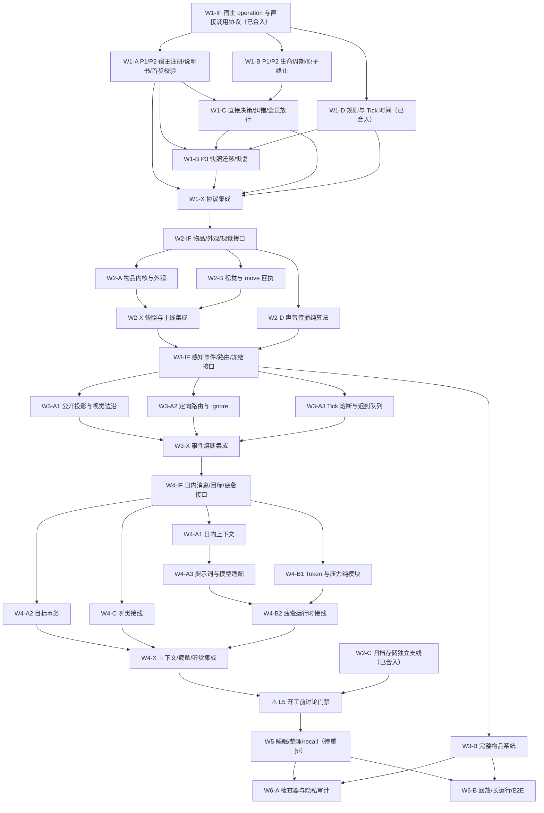

# 角色上下文、感知与记忆系统 — 并行施工编排（Wave Plan）

> 状态：W1-IF、W1-A-P1、W1-D、W2-C 已合入；L1 继续推进 W1-A-P2/W1-B，W1-A-P2 与 W1-B-P2 合入后派 W1-C；L5 设讨论门禁，暂不派发
>
> 行为基线：[《实施 TODO》](./character-context-implementation-todo.md)（下称「TODO」）
>
> 用途：把 TODO 的逻辑依赖拆成可在独立 worktree 中施工、可单独审查的 PR。本文只管依赖、文件所有权和合入顺序，不重复定义行为。

---

## 1. 已拍板的施工前提

以下结论已写回 TODO，任何轨线不得继续按旧代码的 `taskOptions` 语义实现：

1. **operation 必须有宿主**：宿主可以是角色、物品或家具。`move`、`speak`、`recall`、`read`、`wait`、`observe` 挂在 `AgentDefinition.operations`；核心提供权威运行时实现，但不再把它们全局自动授予所有角色。
2. **模型侧没有动态候选清单**：不再为每轮思考生成 `taskOptions`。角色通过 `read` 查询宿主定义中的静态说明书，再直接提交 `operationId`、物品/家具宿主实例和参数；角色自身宿主隐含为自己。清空轨道仍使用稳定空任务分支，空任务不伪装成 operation。
3. **世界条件只在首个执行步骤校验**：决策预检只检查空任务/operation 分支形状、operation 与宿主绑定、轨道、参数 Schema、同步调用一致性、目标补丁和取消协议。距离、能力、占用、材料、所有权及目标当前状态由 operation 在调用建立后的首个执行步骤检查，失败走它预先声明的 `domainFailure`。
4. **`read` 是普通 operation**：挂在角色自身，占用 `HEAD`，声明为 `indeterminate`。放行事务只建立调用；本地结果在放行后、推进下一 Tick 前执行并提交，期间 `worldTick` 不变。因此多个独立 `read` 调用可连续发生在同一 `worldTick`，但每次都有新的决策周期和 `callId`。

调用边界统一为：

```text
静态说明书可查询
  -> AI 输出 head/body：continue、replace(emptyTask) 或 replace(operation 引用)
  -> 协议预检：分支形状、operation 与宿主绑定、轨道、Schema、目标补丁、取消协议
  -> 全员 READY 后原子切换空任务或建立进度 0 的调用
  -> 放行后的首个执行步骤读取权威世界并检查实际前置条件
  -> 可行则执行；不可行则按该 operation 声明的失败码原子结束并熔断
```

未知 operation、宿主实例无法绑定该 operation、宿主引用形式错误或参数 Schema 错误时没有可执行的 operation 契约，因此仍属于无效模型输出并进入纠错，不伪造游戏内失败。

---

## 2. 并行与分支纪律

### 2.1 层内并行、层间汇合

- 每层先合一个 `W<N>-IF` 公共接口 PR。它只放跨轨类型、Schema、窄接口和尚未被调用的接线位，不放业务行为。
- `W<N>-IF` 中涉及世界快照的部分只定义独立字段 Schema 和序列化端口，不提前改线上快照版本。由同一保存格式 owner 在本层各实现轨合入后一次性接入快照、升级版本并补迁移。
- 由于工作区包禁止深路径导入，`W<N>-IF` 必须同时补齐这些公共契约所需的包根导出。实现轨不得再次改同一公共契约；普通实现导出能留到 `W<N>-X` 就留到收口，确因本轨 app 接线需要时只追加自己的最小导出。
- 接口 PR 合入后，各实现轨从新的 `origin/main` 分支并行开工；不得从未合入的上游分支切出。
- 一层最多同时运行 4 条实现轨。某条大轨拆成多个 PR 时，后一个 PR 只能从前一个已合入的 `main` 开始；其他独立轨继续并行，不等它。
- 各实现轨合入后，用一个小型 `W<N>-X` PR 只做跨轨接线、桶导出和跨模块契约测试；不得借集成 PR 偷塞新功能。

### 2.2 分支与 worktree

- 接口分支：`wave<N>/w<N>if-<slug>`。
- 实现分支：`wave<N>/w<N><track>-<slug>`；拆分 PR 用 `-p1`、`-p2`。
- 集成分支：`wave<N>/w<N>x-integration`。
- 一个 worktree 同时只服务一条分支。PR 合入后若继续下一片，删除旧 worktree，再从最新 `origin/main` 建新分支。

### 2.3 TODO 勾选

- PR 只引用并验收自己实际覆盖的 TODO 条目，不再用“某轨覆盖整个阶段”代替逐条核对。
- 阶段 1 的目标更新要到 W4-A2 才闭环；阶段 2 的 `perception_now` 时间接线要到 W3-A3；阶段 5 的声音场景要到 W4-C。对应条目在真正通过验收前保持未勾选。
- TODO 的勾选和 Wave 的合入 SHA 只由合并人在 PR 合入后更新。

---

## 3. 重排后的依赖图



---

## 4. 总览与最大并行度

| 层 | 先行 PR | 并行实现轨 | 收口 PR | 最大并行度 |
| --- | --- | --- | --- | --- |
| L1 | W1-IF（已合入） | W1-A-P1 已合入；当前推进 W1-A-P2 / W1-B-P1，A-P2 与 B-P2 后滚动启动 W1-C | W1-B-P3 → W1-X | 4 |
| L2 | W2-IF | W2-A / W2-B / W2-D | W2-X | 4 |
| L3 | W3-IF | W3-A1 / W3-A2 / W3-A3；W3-B 作为不阻塞 L4 的并行支线 | W3-X | 4 |
| L4 | W4-IF | 首批 W4-A1 / W4-A2 / W4-B1 / W4-C；滚动启动 W4-A3 / W4-B2 | W4-X | 4 |
| L5 | **待讨论** | 暂不派发 | 暂不确定 | 暂不确定 |
| L6 | 无 | W6-A / W6-B | 最终验收 | 2 |

拆分增加的是可审查的合入点，不减少可并行的独立工作。W2-C 已作为独立支线合入，不阻塞 L1-L4，也不再占用后续层的并发名额。

---

## 5. 第一层：宿主 operation、生命周期、决策与时间（L1）

### W1-IF 公共接口 PR（已合入）

- **合入状态**：已于 2026-09-04 通过 PR #4 合入 `main`（merge commit `88c8ac08437099846333dfed3a5fff9abbd12c13`）。该 PR 只完成公共接口地基；W1-A-P1、W1-B-P1、W1-D 的启动依赖已满足，后续 W1-B-P3 仍由同一保存格式 owner 负责。
- **实现边界**：本 PR 没有接入宿主注册、operation 执行、模型决策切换、线上快照版本或迁移；阶段 1 的行为条目仍须由后续轨线通过运行时验收。

- **先行内容**：
  - `AgentDefinition.operations` 与 `AgentOperationDefinition` 骨架。
  - 角色/物品/家具统一宿主引用、operation 静态说明书、外部目标需求和 `ObjectDefinition.capabilities` 类型与 Schema。
  - 统一 operation 的 `start`、可选 `tick`、`complete`、`fail`、`cancel`、`fuse` 生命周期签名和运行结果；A/B 两轨不得各自另建一套。
  - `continue | replace(emptyTask | operation 引用)` 的新版决策 Schema；operation 引用包含 `operationId`、可选宿主实例和参数。
  - 首步校验结果、类型化 `domain_failure | technical_failure`、原子终止事务窄接口。
  - 本层快照新增字段的独立 Schema 片段和序列化端口，不接入线上快照、不升级版本。
- **主写**：`packages/protocol` 新类型文件、`packages/plugin-sdk` 契约类型、`packages/simulation/execution/operation-runtime.ts` 的窄接口、快照 Schema 骨架。
- **禁止**：注册行为、执行行为、模型调用、规则数值。
- **兼容边界**：新版 Schema 与旧生产路径可以在本 PR 内短暂并存，但旧路径不得引用新接口；生产切换由 W1-C 完成，死代码由 W1-X 删除。
- **完成条件**：lint/typecheck/test/build 全绿，所有新接口暂未被生产路径调用或有明确的未实现保护。

### W1-A 宿主注册、说明书、直接调用与首步校验

- **P1 合入状态**：已于 2026-09-04 通过 PR #7 合入 `main`（merge commit `bb9f3b0fb69028c86055cfeddd471fa3c458e0aa`）。已完成角色显式挂载基础 operation、宿主注册与静态说明书校验、角色 `read` operation、对象 `capabilities` 契约及 starter agents 挂载声明；`recall`/`speak` 尚未接入对应运行时，实际调用保持显式技术阻塞。
- **P1 边界**：旧动态候选路径仅保留按角色挂载过滤的过渡兼容；直接调用生产切换、首步世界条件校验及候选路径删除仍由 P2/W1-C/W1-X 完成。阶段 1 的对应验收条目不因本 PR 合入而提前勾选。

- **覆盖**：TODO 阶段 1 中宿主 operation、说明书、目标需求、`capabilities`、直接调用和首步前置校验条目。
- **实现重点**：
  - 核心基础 operation 从全局自动授予迁移到角色定义挂载；starter agents 显式声明所拥有的基础 operation，核心继续提供权威运行时实现。
  - 所有宿主 operation 必须有静态说明书；实现 `HEAD + indeterminate` 的 `read`。放行事务只建调用，结果在放行后、推进下一 Tick 前执行并提交，期间 `worldTick` 不变。
  - 新增直接引用的宿主绑定和参数解析路径，并实现各 operation 自己的 `start` 前置校验；宿主无法绑定时交决策纠错，世界条件留到调用建立后的首个执行步骤。
  - 第一执行步失败必须使用 operation 已声明失败码；通用生命周期何时调用 `start`、如何推进和结束由 W1-B 独占，A 轨不改 action runner。A 轨也不抢改模型请求，旧候选生产路径到 W1-C 切换后才失去引用。
- **主写**：`plugin-sdk/agent`、`plugin-sdk/object`、operation 定义加载校验，`simulation/execution` 的 registry/catalog/planner/adapter/core operation，以及 `plugins/starter-agents`。
- **只读**：W1-IF 公共生命周期契约、W1-B 的 action runner/终止实现、decision（W1-C）、规则（W1-D）。
- **PR 拆分**：P1“宿主/说明书/挂载/read”，P2“直接绑定/首步校验”；P2 必须基于已合入 P1。旧 `buildTaskOptions` 只作过渡兼容，不得扩展，最终由 W1-X 删除。

### W1-B 生命周期、失败分类、终止事务与快照

- **覆盖**：TODO 阶段 1 中 `start/tick/complete/fail/cancel/fuse`、封闭失败码、补偿、终态结果唯一性、执行时间持久化、恢复和变异测试。
- **实现重点**：
  - 通用运行器只通过 W1-IF 生命周期接口调用 operation 的 `start/tick/complete/fail/cancel/fuse`；首个执行步骤只调用一次 `start`，不在运行器内复制各 operation 的世界规则。
  - `domain_failure` 只能来自当前 operation 的目录；未声明错误保持调用未结束并进入 `TECHNICALLY_BLOCKED`。
  - 旧调用退出、补偿、占用释放、终态结果一次原子提交；禁止按错误文字分类或回滚既有事件。
  - `fuse` 只读；固定时长只在调用创建时解析一次，恢复不重算。
- **主写**：P1/P2 独占 `simulation/execution/operation-lifecycle*`、action runner、终止事务与 effect commit 接线，并主写相关 protocol events；P3 主写 `simulation/engine` 的快照 codec/restorer/migrations。
- **本层快照 owner**：只有本轨可修改快照版本号与迁移。W1-IF 只定义字段片段；P3 在 W1-A-P2、W1-C、W1-D 全部合入后一次接入并升级。
- **PR 拆分**：P1“生命周期/失败分类”→P2“原子终止/补偿”可与 W1-A/W1-D 并行；P3“快照迁移/恢复契约”最后合入。

### W1-C 决策纠错与全员原子放行

- **覆盖**：TODO 阶段 1 的直接调用输出、协议预检、纠错循环、尝试耗尽、全员 READY、批量放行及审查界面。
- **启动依赖**：W1-A-P2 与 W1-B-P2 已合入。A 提供直接绑定，B 提供取消/终止事务；因此 C 不需要临时复制这两套行为。
- **边界**：只拒绝非法空任务分支、未知 operation、无法绑定的宿主、错误宿主引用形式、轨道/参数 Schema/同步一致性/目标补丁/取消协议错误；不得检查距离、占用、材料、能力或资源争用。
- **主写**：`simulation/decision/**`、`cognition` 当前决策请求/提示词、`model-gateway/**`、`protocol/model` 与必要 IPC、`apps/simulation-worker` 的决策接线、`apps/local-server` 的决策协调、`apps/web` 决策审查。
- **只读**：execution 的实现；只通过 W1-IF 窄接口建立或取消调用。
- **切换责任**：停止在请求中生成/发送 `taskOptions`，切换到直接引用协议；保留仍被旧快照迁移读取的旧 Schema，待 W1-B-P3/W1-X 收口。
- **注意**：本轨只提供 `GoalUpdateValidator` 接口和原子挂点；目标状态与实际补丁行为由 W4-A2 完成，对应 TODO 暂不勾选为闭环。

### W1-D 规则收尾与 Tick 时间（已合入）

- **合入状态**：已于 2026-09-05 通过 PR #5 合入 `main`（merge commit `d44a7930638f44af8332362ddf028ad895c07a31`）；W1-B-P3、W1-X 及 W2-D 对 W1-D 的依赖已满足。
- **已完成范围**：补齐墙、开门和关门声音衰减规则及严格 Schema；把 Worker 现实调度间隔移入本地配置并限制 Node 定时器边界；将策略字面量 AST 扫描接入 `pnpm lint`；提供角色时间投影、Tick 锚点结构及清醒/睡眠/整理时长的纯派生 API。
- **实现边界**：本轨没有把时间写入 `perception_now`，没有在角色生命周期或线上快照中写入锚点，也没有实现声音传播场景和 L5 睡眠数值；这些条目继续保持未完成并由既定后续轨线接入。

- **覆盖**：阶段 0 中已确认且 L1-L4 会消费的剩余项，以及阶段 2 的时间投影 API、角色 Tick 锚点和倍速确定性。
- **实现重点**：补齐声音墙/门衰减、当前已确定的 operation 参数和静态扫描门禁；部署参数留本地配置。只提供角色时间投影，真正写入 `perception_now` 由 W3-A3 完成。L5 的睡眠曲线与其他待讨论数值不得在本轨猜定，对应 TODO 保持未勾选。
- **主写**：`content/rules/**`、`protocol/rules/**`、`simulation/world` 时间模块、`scripts/**` 与必要本地配置文件。
- **只读**：operation、decision、快照 codec；锚点序列化形状由 W1-IF/W1-B 处理。

### W1-X 协议集成

- 删除旧 `taskOptions`、`TaskOptionId`、`offers/buildTaskOptions`、面向模型的 `available_interactions` 查询、调用建立阶段的 `canStart` 预筛，以及全局自动授予核心 operation 路径的残留导出与死代码；旧快照只能经 W1-B-P3 的显式迁移进入新版。
- 建立跨模块测试：空任务不创建调用；角色未挂载 operation 时不可调用；说明书不随世界状态变化；可绑定调用的世界前置失败发生在首个执行步骤；无效引用走纠错；`read` 在放行后、推进下一 Tick 前完成且 `worldTick` 不变，并可在同一 Tick 连续形成独立调用。
- 全量五件套通过后才进入 L2。

---

## 6. 第二层：物品外观、视觉、存储与声音算法（L2）

### W2-IF 公共接口 PR

- 定义最小物品身份/归属、`bodyFacts`、六字段外观、只读 `externallyVisible`、移动轨迹、`nearby`、`perception_now`、连续视觉状态和声音传播结果的类型骨架。
- 一次性定义 L2 所需快照字段片段和序列化端口，但不改线上快照版本；提交该 PR 的 W2-A agent 也是 W2-X 保存格式 owner。
- 本 PR 补齐上述公共契约的包根导出；后续实现轨不得漂移 W2-B/W2-D 已开始消费的接口。
- W2-B 只能依赖公开外观读取接口，不能读取 W2-A 私有状态。

### W2-A 最小物品内核与角色外观

- **覆盖**：TODO 阶段 3；`capabilities` 和通用 `read` 框架已在 L1 完成，本轨只为新物品/家具正确声明能力、operation 与说明书。
- **P1**：物品定义/实例/容量/归属、`bodyFacts`、衣服锚点与实例状态、六字段外观、权限，以及对 W2-IF 序列化端口的模块级测试。
- **P2**：`wear`/`undress`/`adjust_clothing`/梳妆台化妆，`appearanceAfter` 暂存与原子提交，首步失败、隐私和场景测试。
- **主写**：simulation 物品/外观新增模块、plugin-sdk 的定义加载实现和 `plugins/home-objects` 梳妆台；W2-IF 的公共类型只读，线上快照文件留给 W2-X。
- **禁碰**：`simulation/perception/**`。

### W2-B 视觉与 move 回执

- **覆盖**：TODO 阶段 4 全部条目。
- **依赖**：W2-IF 的公开外观读取接口，不依赖 W2-A 私有实现。
- **主写**：`simulation/perception/vision/**` 与 move 专属执行文件；W2-IF 的 `nearby/perception_now` 契约只读。
- **禁碰**：物品/外观状态、声音目录和线上快照文件。

### W2-C 归档存储地基

- **合入状态**：已于 2026-09-04 通过 PR #3 合入 `main`（merge commit `299e01969daa438d5799449d516fd6385d1d771a`）；L5 讨论门禁对 W2-C 的前置已满足。
- **启动依赖（已满足）**：本轨已独立完成，不等待任何 L1-L4 代码 PR；上述“可与 W1-IF 同时启动”仅保留为历史编排说明。
- **覆盖**：TODO 阶段 10 的 SQLite Schema、记录隔离、衰减/删除、FTS/向量索引、编码器锁与纯排序接口。
- **主写**：`timeline/**` 的存储领域接口与 `sqlite-store/**` 的实现和迁移。
- **禁碰**：protocol IPC、simulation、cognition 与 worker/host 接线。L5 如何跨进程调用及其 DTO 留到讨论门禁。
- SQLite migration 版本由本轨独占，它与世界快照版本不是同一个版本号。

### W2-D 声音传播纯算法

- **覆盖**：TODO 阶段 11 的三档强度、距离衰减、墙门遮挡、阈值、相对方位、确定性模糊与恢复测试。
- **依赖**：W1-D 已合入的声音规则和现有地图几何。
- **主写**：`simulation/perception/audition/**`；W2-IF 的声音传播结果类型只读。
- **禁碰**：`speak` 完成接线、事件路由、持续声音状态机。

### W2-X 快照与主线集成

- **启动依赖**：W2-A-P2 与 W2-B 已合入；W2-D 独立作为 W3-IF 的另一项依赖，W2-C 不阻塞本 PR。
- 由 W2-IF/W2-A 的同一保存格式 owner 把已声明字段一次接入线上快照、升级版本并完成迁移；其他轨不得代改版本。
- 只做桶导出、物品外观与视觉的恢复场景及全量验证，不新增业务行为。完成后与 W2-D 一起解锁 W3-IF。

---

## 7. 第三层：语义感知、熔断与完整物品系统（L3）

### W3-IF 公共接口 PR

- 定义 `perception_event` 信封、公开行为组合、视觉/对象边沿、定向互动、声音事件、声明式 `ignore`、Tick 触发批次、输入截止序号与迟到结果队列接口。
- 同时定义 W3-B 两步转移所需的目标互动提交端口，以及本层全部快照字段片段。
- 本 PR 补齐上述公共契约的包根导出；A1/A2/A3/B 实现轨不得并行修改这些契约文件。
- 提交本 PR 的 W3-A3 agent 也是 W3-X 保存格式 owner；其他轨不得改线上快照 Schema、版本或迁移。

### W3-A1 公开投影与视觉/对象语义边沿

- **覆盖**：TODO 阶段 5 的公开行为组合、人物出现/行为/外观变化、对象公开状态边沿、可见阶段持久化与隐私测试。
- **主写**：`simulation/perception/visual-events/**` 与 plugin-sdk 公开观察边沿的加载/校验实现；W3-IF 的 protocol event payload 只读。
- **只读**：W2 视觉与外观接口；禁碰 Tick 管线。

### W3-A2 角色定向路由与 `ignore`

- **覆盖**：事实/投递/触发分离、角色私有路由、完成后身份裁剪、声明式属性比较、HEAD/BODY 覆盖合并、生命周期信号不可忽略。
- **主写**：`simulation/perception/routing/**` 与 `simulation/perception/ignore/**`；W3-IF 的 protocol events 只读。
- **只读**：operation 生命周期和 engine Tick 管线。

### W3-A3 Tick 熔断、输入组装与迟到队列

- **覆盖**：`freezePending`、Tick 唯一合并窗口、回执→触发→`perception_now` 排序、时间投影接线、输入封口、持久化接收序号和同冻结 Tick 队列处理。
- **主写**：`simulation/engine/**` 与 Tick 管线新增接线；线上快照 codec/restorer/migration 留给 W3-X。
- **只读**：A1/A2 的接口；不在本轨重写其过滤和投递规则。

### W3-B 完整插件化物品与家具系统（并行支线）

- **启动依赖**：W2-A 已完整合入，且 W3-IF 的定向互动端口已合入。它不阻塞 L4/L5 主线，但属于 W6 的硬依赖，不是可取消的可选功能。
- **P1**：所有物品容量、角色/家具/世界坐标三类归属、无容器嵌套、世界掉落实体、可见性，以及对 W3-IF 序列化端口的模块级测试。
- **P2**：携带物品到家具、多实例原子处理、配方生产、销毁声明、`give/accept` 两步转移及恢复测试。
- **主写**：plugin-sdk 物品协议、`plugins/**` 对应对象、simulation 物品裁决/归属/交互新增模块。
- **禁碰**：W3-A1/A2/A3 主写目录和线上快照文件；需要的新字段必须在 W3-IF 先声明，接口不足时停止并补独立接口 PR。

### W3-X 事件熔断集成

- 从 W3-A1/A2/A3 组装同 Tick 多事件、多角色隔离、指定目标完成事务和隐私场景；定向互动可使用测试 operation，不等待 W3-B。
- 由保存格式 owner 把 W3-IF 的事件、队列和预留物品字段一次接入线上快照、升级版本并完成恢复/回放测试；W3-B 后续只写已经预留的字段。
- `speak` 与持续环境声的完整传播场景留给 W4-C；阶段 5 的相关 TODO 到 W4-C 后再勾选。
- 全量五件套通过后即可进入 L4；W3-B 可继续并行施工，但必须在 W6 前完成自己的 `give/accept` 与物品场景。

---

## 8. 第四层：日内上下文、目标、Token 疲惫与听觉（L4）

### W4-IF 公共接口 PR

- 定义日内语义消息、上下文读写、目标补丁、Token 分区统计、疲惫分解、昏睡信号和持续声音状态接口。
- 定义本层所有快照字段片段和 app 接线端口；提交本 PR 的 W4-A1 agent 也是 W4-X 保存格式 owner，接口 PR 不改线上快照版本。
- 本 PR 补齐上述公共契约的包根导出；A/B/C 实现轨发现不足时先补独立接口 PR，不得各自改出不兼容形状。

### W4-A1 日内上下文

- **覆盖**：阶段 6 的本地消息时间线、分支语义、`operation_call/result`、`perception_event/now`、因果引用、幂等与顺序，以及 W4-IF 序列化端口的模块级测试。
- **主写**：`cognition/context/**`、simulation 上下文状态与写入点和 simulation-worker 请求组装接线；simulation 只能依赖 protocol 中的消息类型，不得反向依赖 cognition。线上快照文件留给 W4-X。
- **禁止**：目标更新行为、模型供应商适配、记忆整理。

### W4-A2 目标事务

- **覆盖**：长期/短期目标状态、严格 `goalUpdates`、角色权限、与双轨调用同事务提交、上下文记录。
- **依赖**：W1-C 的 validator 挂点和 W4-IF 类型。
- **主写**：simulation 目标状态与 `simulation/decision` 的 validator 实现/release 接线；W4-IF 的目标协议只读。

### W4-A3 提示词组装与模型适配

- **启动条件**：W4-A1 已合入。
- **覆盖**：稳定认知区块顺序、区域语义地图位置、衣物/身体状态、日内消息渲染、厂商无关消息与不同供应商投影；不得重新加入动态 `taskOptions`。
- **主写**：`cognition` prompt/context 渲染、`model-gateway` 适配器和必要 simulation-worker 接线；W4-IF 的厂商无关消息协议只读。

### W4-B1 Token 与疲惫纯模块

- **覆盖**：真实 Token 计数策略、分区统计、200k 预算与预留、时间/Token 压力归一化、集中配置和校准工具。
- **主写**：`cognition/token/**`、`simulation/fatigue` 纯计算、规则字段和仿真脚本。
- **边界**：先对 W4-IF 的规范消息输入计数，不抢改 W4-A1/A3 文件；simulation 疲惫纯函数只接收 protocol 统计值，不得导入 cognition。

### W4-B2 疲惫运行时接线

- **启动条件**：W4-A3 与 W4-B1 已合入。
- 把真实组装请求的 Token 分区统计接入角色疲惫状态、警戒感知、技术硬上限和强制昏睡信号；完成长时间仿真校准与变异验证。
- **主写**：simulation 疲惫接线新增文件；检查器投影和快照字段使用 W4-IF 已定义的协议。

### W4-C 听觉接线

- **覆盖**：`speak` 完成 Tick 的一次性多接收者传播、来源/方位、逐接收者持久化、失败取消不投递，以及持续声音出现/内容/消失状态机。
- **依赖**：W2-D 算法、W3-A2 路由、W3-A3 熔断、W4-IF 消息接口。
- **主写**：消费 L1 `speak` 正常完成信号的 simulation 接线、hearing state 新目录和环境声音插件声明；不得重新全局注册或绕过角色挂载 `speak`。
- **完成责任**：同时关闭阶段 5 中此前延后的声音契约测试和阶段 11 剩余条目。

### W4-X 上下文、疲惫与听觉集成

- 由 W4-IF/W4-A1 的同一保存格式 owner 把上下文、目标、疲惫和听觉字段一次接入线上快照、升级版本并完成迁移。
- 验证恢复后请求一致、goal 与任务原子提交、声音进入正确角色的日内上下文、Token 分解可解释、动态 `taskOptions` 不再出现。
- 全量五件套通过后，停在 L5 讨论门禁，不直接开工睡眠/记忆/recall。

---

## 9. ⚠️ 第五层开工前讨论门禁（L5）

L5 暂不派发 agent，也不预写最终文件所有权和实现提示词。开工前必须单独讨论并写回 TODO/Wave：

1. simulation-worker 如何在先提交检查点后，请求 local-server 执行记忆整理和 SQLite 检索。
2. 整理请求/结果与 `recall` 请求/结果的 IPC 身份、版本锁、持久化接收序号、重试、迟到和历史回放协议。
3. `cognition`、`simulation` 不直接依赖 `sqlite-store/model-gateway` 的具体端口放置与 app 组合方式。
4. L5 快照 owner、SQLite owner、模型调用审计 owner，以及 W5-A/B/C 是否仍可同层并行。
5. 睡眠曲线、记忆重要性参数、检索权重和本地编码器后端的校准/选型结果。

讨论完成后先提交 `W5-IF`，再决定 W5-A 睡眠状态机、W5-B 整理与落库、W5-C recall 接入的最终拆分。任何 agent 不得在此门禁前建立临时跨包依赖或把 SQLite 状态复制进模拟进程。

---

## 10. 第六层：观测与端到端验收（L6）

仅在 L5 全部合入且 W3-B 已验收后启动：

### W6-A 检查器与隐私审计

- 主写 `apps/web` 检查器和隐私审计脚本。
- 展示双轨调用、进度、疲惫分解、睡眠整理、Token、容量和物品；自动检查隐藏衣物、未知空间、未听见声音、匿名互动、operation 私有参数和 recall 私有内容不泄漏。

### W6-B 回放、长运行与端到端场景

- 主写 `tests/**` 与进程集成测试。
- 覆盖确定性回放、决策纠错、多人原子放行、失败分类、跨日无界增长，以及移动→熔断→上下文→睡眠整理→次日提示词→recall→生产得物品。

W6 发现运行时缺陷时单独开修复 PR，不在验收轨越权修改实现包。

---

## 11. 保存格式 owner

接口 PR 只声明独立字段 Schema；实现合流后，下面的 owner 才能修改线上世界快照 Schema、版本和迁移文件：

| 层 | 接口/实现 owner | 其他轨如何增加字段 |
| --- | --- | --- |
| L1 | W1-IF 与 W1-B-P3：同一个 W1-B agent | P3 等 A/C/D 合入后一次升级并迁移 |
| L2 | W2-IF 与 W2-X：同一个 W2-A agent | X 等 A/B 合入后一次升级并迁移 |
| L3 | W3-IF 与 W3-X：同一个 W3-A3 agent | X 等 A1/A2/A3 合入后一次升级；预留 W3-B 字段 |
| L4 | W4-IF 与 W4-X：同一个 W4-A1 agent | X 等全部 L4 轨合入后一次升级并迁移 |
| L5 | 待讨论 | 门禁解除时指定 |

SQLite migration 由 W2-C 独占，不与世界快照共用版本号。

---

## 12. 合入与验收纪律

1. 开工前读 `AGENTS.md`、`PHILOSOPHY.md`、本轨涉及的 TODO 全部条目及约束 70-78、再读本轨卡。
2. 每个修复和行为变更都有可观察测试；关键测试必须做变异验证并在 PR 描述记录“恢复旧行为后测试确实失败”。
3. 每个 PR 运行与风险相称的局部检查；轨线最终 PR 和每层 `W<N>-X` 必须执行 `pnpm lint && pnpm typecheck && pnpm test && pnpm build && pnpm test:e2e`。
4. GitHub 通信始终显式使用 `socks5://127.0.0.1:7897`；不自行 merge。
5. 合并冲突只解决本轨所有权内的文件；共享接口与保存格式冲突立即停止并交给当层 owner。
6. `private/`、`free_model.local`、真实密钥、模型真实响应、`data/` 和 `workspace/` 永不提交。

---

## 13. 风险登记

| 风险 | 处理 |
| --- | --- |
| 旧动态候选语义残留在 `taskOptions`、`offers`、`available_interactions` 或 `canStart` | W1-C 停止生产使用，W1-X 删除死代码并做仓库级扫描与行为测试 |
| 首步世界校验被错误搬回决策预检 | W1-X 用占用/距离/材料不足场景确认调用先建立再游戏内失败 |
| 大轨 PR 无法审查 | W1-B、W2-A、W3-B、W4-A、W4-B 按卡片拆顺序 PR；其他轨持续并行 |
| 多轨同时改快照 | 每层唯一 owner；字段必须在先行接口 PR 一次声明 |
| W3-B 延期影响最终场景 | 保持为不阻塞 L4/L5 的并行支线，但 W6 启动门禁必须确认其已合入 |
| L5 临时跨包接线破坏唯一权威世界 | 讨论门禁未解除前禁止派发 |
