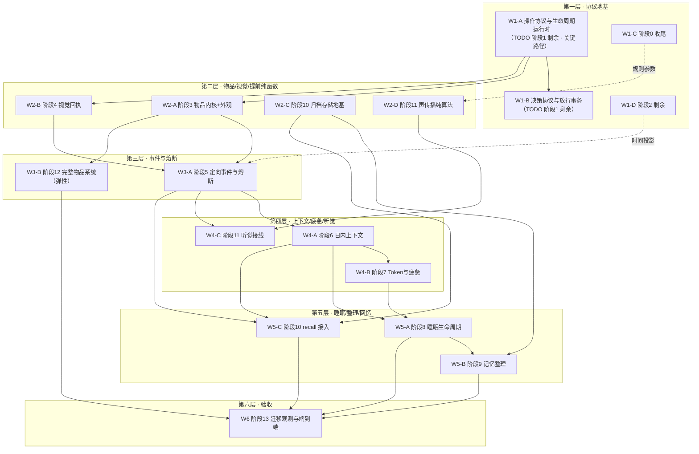

# 角色上下文、感知与记忆系统 — 并行施工编排（Wave Plan）

> 状态：待派发
>
> 基线文档：[《实施 TODO》](./character-context-implementation-todo.md)（2026-09-02，下称「TODO」）
>
> 用途：把 TODO 的阶段串行序重排为「层内并行、层间汇合」的施工波次，供多 agent 在不同 git worktree 中并行执行。
>
> **与 TODO 的关系**：TODO 的阶段顺序是逻辑依赖序与验收基线，保持不变；本文只重排施工顺序。每个阶段的完成标准仍以 TODO 的「完成门槛」为准，勾选动作只发生在轨线合并回主线之后（TODO 维护规则 2）。

---

## 1. 编排模型

### 1.1 Wave 模型

- **层（Wave）内**：若干轨线（Workstream）各自在独立 worktree 并行施工，互不等待。
- **层间**：全部轨线合并回主线、测试通过后，下一层从合并后的主线切出。
- **最大并行度**：4（第二层）。总波次：6 层。相比 14 个阶段严格串行，关键路径压缩到 6 波。

### 1.2 三条铁律

1. **接口先行**：每层启动时，先把「跨轨引用的类型/接口骨架」以最小 PR 合入主线，各 worktree 随即 rebase。骨架只含类型定义、Schema、空实现或 `throw new Error("not implemented")`，不含行为逻辑。每个轨线卡的「接口先行」字段列出了该层必须先合的内容。
2. **文件所有权**：每个轨线卡列出「主写 / 只读 / 禁碰」。共享包（`protocol`、`simulation`）按文件级切分，`index.ts` 桶文件的导出追加冲突在层末合并时统一整理，不在层中争抢。
3. **层末汇合勾选**：轨线完成 → 回主线提 PR → 测试全绿 → 按 TODO 维护规则勾选对应条目 → 进入下一层。任何轨线不得在未合并产物上提前开工下游任务。

### 1.3 分支与 worktree 约定

- 分支命名：`wave<N>/<轨线号>-<slug>`，如 `wave1/w1a-operation-protocol`。
- worktree 目录：`../GodSimulation-wt/<轨线号>`。
- 每个轨线开工前 `git rebase` 到当层主线 HEAD（含接口先行 PR）。

---

## 2. 依赖分析与关键路径

TODO 写明「不应跨阶段抢先实现上层行为」，但那是对**架构纪律**的要求——上层行为不得先于其依赖的协议存在。逐项核对 69 条行为约束与实际代码后，以下三块的依赖比阶段序号看起来松得多，是并行空间的来源：

1. **纯函数/纯存储可以提前**：阶段 10 的归档记忆存储（SQLite Schema、FTS/向量索引、编码器锁、跨天衰减重算）只依赖约束 29/31/32 和已完成的规则集（阶段 0），不依赖阶段 8/9 的运行时状态机。阶段 11 的声音传播算法（三档强度 → 衰减 → 接收阈值 → 相对方位）只依赖已完成的规则集声音参数和几何数据。两者都是零共享文件的独立轨线。
2. **阶段 3 与阶段 4 互不依赖**，都只依赖阶段 1 的协议：阶段 3 要 operation 框架（wear/undress 是 operation），阶段 4 要熔断回执协议（move 的 nearby 回执）。
3. **阶段 12 被 TODO 标注「后置」**，只依赖阶段 3 的物品内核，不阻塞任何主线轨线，作为弹性轨填充。

**关键路径**（任何一条延迟都推迟整体交付）：

```
阶段1 → 阶段3/4 → 阶段5 → 阶段6 → 阶段8/9 → 阶段10recall → 阶段13
```

**提前轨**（不影响关键路径，早做早省心）：阶段 10 存储、阶段 11 算法、阶段 12、阶段 0/2 收尾。

### 依赖总图



---

## 3. 总览表

| 层 | 轨线 | 覆盖 TODO | 依赖 | 并行度 | 关键路径 |
|----|------|-----------|------|--------|----------|
| L1 | W1-A 操作协议与生命周期 | 阶段 1（约 24 条剩余） | 无 | 4 | ✅ |
| L1 | W1-B 决策协议与放行 | 阶段 1（约 6 条剩余） | W1-A 接口先行 | 同上 | ✅ |
| L1 | W1-C 阶段 0 收尾 | 阶段 0（3 条剩余） | 无 | 同上 | ❌ |
| L1 | W1-D 阶段 2 剩余 | 阶段 2（3 条剩余） | 无 | 同上 | 弱（供 L3） |
| L2 | W2-A 物品内核与外观 | 阶段 3（全部 23 条） | W1-A | 4 | ✅ |
| L2 | W2-B 视觉感知与动作回执 | 阶段 4（全部 10 条） | W1-A | 同上 | ✅ |
| L2 | W2-C 归档存储地基 | 阶段 10 存储侧（约 8 条） | 无（规则集已就绪） | 同上 | ❌ |
| L2 | W2-D 声传播纯算法 | 阶段 11 算法侧（约 5 条） | W1-C 声音参数 | 同上 | ❌ |
| L3 | W3-A 定向事件与熔断 | 阶段 5（全部 34 条） | W1-A/B、W2-A/B、W1-D | 2 | ✅ |
| L3 | W3-B 完整物品系统 | 阶段 12（全部 16 条） | W2-A | 同上 | ❌ 弹性 |
| L4 | W4-A 日内上下文 | 阶段 6（全部 24 条） | W3-A、W2-B | 3 | ✅ |
| L4 | W4-B Token 与疲惫 | 阶段 7（全部 8 条） | W4-A 消息类型（接口先行） | 同上 | ✅ |
| L4 | W4-C 听觉接线 | 阶段 11 剩余（约 6 条） | W3-A、W2-D | 同上 | ❌ |
| L5 | W5-A 睡眠生命周期 | 阶段 8（全部 11 条） | W4-A、W4-B、W3-A | 3 | ✅ |
| L5 | W5-B 记忆整理 | 阶段 9（全部 13 条） | W5-A 整理事务接口、W2-C | 同上 | ✅ |
| L5 | W5-C recall 接入 | 阶段 10 剩余（约 12 条） | W2-C、W3-A、W4-A | 同上 | ✅ |
| L6 | W6 端到端验收 | 阶段 13（8 条剩余） | 全部 | 1–2 | ✅ |

> **2026-09-04 拍板增补**：TODO 第 4 节 8 组未决项已全部拍板，写入约束 70-78，并在阶段 1（+3 条，target 需求/候选过滤/契约统一测试）、阶段 3（+4 条，容量整数化/`capabilities`/说明书机制/测试）、阶段 11（+2 条，遮挡衰减/测试）、阶段 12（+5 条，嵌套禁令/产物配方/抛弃形态/销毁能力/两步转移）新增 14 条 TODO，阶段 7/8/9/10 新增 5 条数值校准 TODO。这些增量按归属直接并入对应轨线：W1-A（阶段 1 增量）、W2-A（阶段 3 增量）、W2-D + W4-C（阶段 11 增量，注意 W2-D 的声传播算法现在要含墙门遮挡）、W3-B（阶段 12 增量）、W4-B/W5-A/W5-B/W5-C（校准条目，数值不阻塞开工）。上表条目数为拍板前基数，施工以 TODO 文档当前清单为准。

---

## 4. 第一层：协议地基（L1）

> 本层是全局阻塞点，优先投入最强人力。层末必须达成：TODO 阶段 0/1/2 全部勾选，operation 协议与决策协议冻结，后续层的接口引用全部指向本层产物。

### W1-A 操作协议与生命周期运行时 ⚡ 关键路径

- **覆盖**：TODO 阶段 1 剩余条目中的操作面与运行面（约 24 条）：
  - 统一操作工具注册框架（稳定 ID、`taskSlots`、参数 Schema、候选/可用性规则、时长协议、`ignore` 规则、`publicBehavior`、生命周期、结果 Schema；`move`/`recall` 同框架）
  - `speak` 音量三档枚举 Schema（无 `targetCharacterId`）
  - `publicBehavior` 必填协议（显式 `hidden` 或结构化投影，定义加载时拒绝缺失）
  - 作用角色协议：`targetCharacterId` 声明/校验/锁定/禁定向提前通知/完成事务三件套原子提交
  - `indeterminate` 判定纪律（动态改道/外部等待不得冒充固定时长）
  - 统一生命周期协议（`start`/`tick`/`complete`/`fail`/`cancel`/`fuse`）
  - 封闭 `domainFailure` 目录 + 类型化错误分类器（禁按消息字符串分类）+ `TECHNICALLY_BLOCKED` 语义
  - 熔断回执自声明/与触发输入分离/只读不改状态
  - 终态 `operation_result` 唯一性（`completed|failed|cancelled`、先效果后回执）
  - 禁回滚 + 补偿效果 + 原子终止事务（含替换执行中交互的取消与占用释放）
  - 自动微步骤协议（结果必须进最终或熔断回执）
  - `startedAtTick`/时长/终止 Tick/终止来源入事件、快照、恢复、分支
  - 任务完成/失败/不可继续的熔断触发规则
  - 操作协议契约测试（TODO 阶段 1 倒数第 3 条）
- **2026-09-04 拍板新增 3 条（约束 74、75、77，务必纳入工作量评估）**：
  - 统一目标需求声明：operation 一律定义在宿主对象内；契约层声明无目标/目标角色/`requiredCapabilities` 目标对象；核心做候选过滤、调用校验、目标 ID 随 `callId` 锁定三件事，禁止自约定目标字段名
  - 候选生成只按可达性与目标能力过滤，**不调用 `canStart` 预筛**；前置不满足由 operation 首步权威校验并以失败码原子关闭
  - 契约统一测试：所有注册操作过同一份 `assertOperationContract`，拒绝缺字段或自造终态流程
- **依赖输入**：无（基于已合并的 `HEAD/BODY` 双轨与 `activeOperations` 现状）。
- **产出契约**（下游全部依赖）：
  - `packages/protocol`：operation 定义/调用/结果/时长/失败码的完整类型与 Schema
  - `packages/plugin-sdk/operation`：操作注册与生命周期接口
  - `packages/simulation/execution`：操作运行时（原子终止事务、补偿、熔断只读回执）
  - 快照 schema 升级（含时长字段）与迁移
- **文件所有权**：主写 `packages/protocol/**`（rules 除外）、`packages/plugin-sdk/operation/**`、`packages/simulation/execution/**`、`packages/simulation/interaction/**`；只读 `packages/simulation/decision/**`；禁碰 `content/rules/**`、`packages/model-gateway/**`。
- **接口先行**：开工第 1–2 天先合 `protocol` 的 operation 类型骨架 PR（W1-B 的预检要引用这些类型）。
- **完成门槛**：TODO 阶段 1 完成门槛 + 操作协议契约测试全绿。

### W1-B 决策协议与放行事务 ⚡ 关键路径

- **覆盖**：TODO 阶段 1 剩余条目中的决策面（约 6 条）：
  - 模型输出协议 `head`/`body`/`goalUpdates` 严格 Schema（同步候选同 ID 同参数）
  - 完整决策预检（候选/`taskSlots`/参数/目标补丁/取消前置/资源占用，整份拒绝）
  - 纠错循环（整份重输出、临时校验反馈、不进入角色上下文）
  - 纠错上限 → `TECHNICALLY_BLOCKED`，禁止任何兜底代选
  - 全员 READY 后全局预检 + 单事务放行（禁按返回顺序逐个生效）
  - 决策审查界面随输出协议更新
- **依赖输入**：W1-A 接口先行 PR（operation 类型、候选/可用性规则类型）。
- **产出契约**：`simulation/decision` 的预检/纠错/放行事务；`model-gateway` 结构化输出 Schema；`GoalUpdateValidator` 接口（**实现**留给 W4-A，本轨只定义接口与预检钩子）。
- **文件所有权**：主写 `packages/simulation/decision/**`、`packages/model-gateway/**`、`apps/web`（决策审查）；只读 `packages/protocol/**`；禁碰 `packages/simulation/execution/**`（W1-A 地盘，放行事务的边界通过接口先行 PR 约定）。
- **接口先行**：依赖 W1-A 的类型骨架；自身无需先行产物。
- **完成门槛**：TODO 阶段 1 决策面条目全绿 + 纠错循环与全局放行场景测试。

### W1-C 阶段 0 收尾（小轨）

- **覆盖**：TODO 阶段 0 剩余 3 条：补入睡眠换算参数、通用 operation 固定时长、感知/事件阈值；部署参数（现实调度、服务地址、凭据、GPU、纠错上限）剥离到本地运行配置；策略字面量扫描固化为静态门禁。
- **依赖输入**：无。
- **产出契约**：`content/rules/default.json` 完整参数集（**W2-D 和第五层直接消费**，必须在 L2 开工前合入）；`scripts/` 字面量扫描门禁接入 CI。
- **文件所有权**：主写 `content/**`、`packages/protocol/rules/**`、`scripts/**`；禁碰 operation/decision 代码。
- **完成门槛**：TODO 阶段 0 完成门槛。

### W1-D 阶段 2 剩余（小轨）

- **覆盖**：TODO 阶段 2 剩余 3 条：角色时间感知投影（`worldTick` → 游戏日/时分，供 `perception_now`）；角色 Tick 锚点（最后醒来/入睡/整理开始，派生时长而非可写状态）；倍速只影响调度频率的验证。
- **依赖输入**：无（规则锁与 `projectGameTime` 已完成）。
- **产出契约**：角色时间投影 API（**W3-A 的 `perception_now` 直接消费**）；角色锚点字段入快照。
- **文件所有权**：主写 `packages/simulation/world/**`（时间投影与锚点）、`packages/protocol`（时间投影类型，限新增文件）；注意快照 schema 若与 W1-A 同时改，**快照版本统一归 W1-A 管理**，W1-D 的锚点字段通过 W1-A 的 schema 合入（两轨开工时对齐一次即可，字段互不交叉）。
- **完成门槛**：TODO 阶段 2 完成门槛。

> W1-C/W1-D 体量小，完成后对应 agent 可支援 W1-A 的契约测试编写，或提前起草 W2 层的接口骨架 PR。

---

## 5. 第二层：物品、视觉与提前纯函数（L2）

> 本层 4 轨并行，是全文最大并行点。W2-A/W2-B 在关键路径上；W2-C/W2-D 是提前轨，产出供 L3–L5 消费。

### W2-A 最小可穿戴物品内核与角色外观（阶段 3）⚡ 关键路径

- **覆盖**：TODO 阶段 3 全部 23 条：最小物品内核（定义 ID/实例 ID/容量占用/`carried|worn` 归属）、`bodyFacts`（含写权限协议）、衣服样式语义锚点与实例状态、六字段外观状态（`externallyVisible`/`internallyHidden` × 头/上身/下身）、`appearanceAfter` 随调用暂存与原子提交、`wear`/`undress`/`adjust_clothing`/梳妆台化妆四个 operation、容量规则（9 单位、穿着不占容量、`carry_capacity_full` 首步校验）、赤裸状态、只读对外外观接口、快照/恢复/回放、全套场景测试。
- **2026-09-04 拍板新增 4 条（约束 70、73、76、77）**：
  - `ObjectDefinition` 新增 `capabilities: string[]`，与 `tags` 严格分离（类别不参与匹配）+ SDK 类型校验 + 现有插件定义同步更新
  - 说明书机制：核心通用 `read` 工具（按类型取静态说明、不含当前可用状态、缺声明加载期拒绝）+ 系统提示词声明其存在
  - 容量占用非负整数、只在规则集维护、读取时现算（不进快照）
  - 配套测试：容量整数、规则集变更无需迁移、同类型同说明书、说明书不随世界漂移、`read` 不泄漏私有状态
- **依赖输入**：W1-A 的 operation 框架、原子终止事务、`domainFailure` 目录、快照 schema。
- **产出契约**：
  - 物品/外观/`bodyFacts` 类型与状态（**W3-A 的 `visible_appearance_changed` 消费外观版本；W3-B 扩展物品体系；W4-A 的系统提示词消费衣物状态**）
  - 四个外观 operation 的 `publicBehavior` 投影（执行中显示「正在穿衣/脱衣/整理/化妆」+ 旧外观）
- **文件所有权**：主写 `packages/protocol`（物品/外观类型新文件）、`packages/plugin-sdk`（物品注册）、`packages/simulation`（物品/外观状态与四个 operation 实现，限新增模块）、`plugins/home-objects`（梳妆台）；只读 `simulation/execution` 运行时接口；禁碰 `simulation/perception/**`（W2-B 地盘）。
- **接口先行**：物品定义/实例/归属与外观状态类型骨架（W3-B 也在等这套类型）。
- **完成门槛**：TODO 阶段 3 完成门槛。

### W2-B 视觉感知结果与动作回执（阶段 4）⚡ 关键路径

- **覆盖**：TODO 阶段 4 全部 10 条：`nearby`/`perception_now` 结构化协议分离、移动轨迹输出与视线扫掠累积（不假设单 Tick 一格）、`nearby` 聚合去重与概略渲染、`move` 成功/失败/熔断三类回执、跨熔断的视觉累积游标、自动开门与绕行的内部恢复叙事、全套确定性测试。
- **依赖输入**：W1-A 的熔断回执协议与 `move` 运行时不确定性契约。
- **产出契约**：
  - `nearby` 与 `perception_now` 协议类型（**W3-A 生成 `perception_now`、W4-A 写入对话**）
  - 连续视觉状态接口（**W3-A 的认知事件边沿检测基于此**）
- **文件所有权**：主写 `packages/simulation/perception/**`、`packages/protocol`（nearby/perception 类型新文件）、`simulation/execution` 中 move 相关文件；禁碰物品/外观模块。
- **接口先行**：`nearby`/`perception_now`/连续视觉状态类型骨架。
- **完成门槛**：TODO 阶段 4 完成门槛。

### W2-C 归档记忆存储地基（阶段 10 存储侧，提前轨）

- **覆盖**：TODO 阶段 10 中纯存储与纯计算条目（约 8 条）：归档记忆 SQLite Schema（按世界/分支/角色/整理周期隔离）、正文/来源/形成 Tick/归档 Tick/重要性与索引存储、重要性→初始强度/半衰期/删除阈值的程序映射、跨天边界指数衰减直接重算（跨多日一次计算 ≡ 逐日计算，禁浮点累积）、删除执行、FTS 全文索引 + 向量索引与双路命中按记录 ID 合并、编码器抽象与模型锁（ID/版本/维度/归一化/模型文件身份）。
- **依赖输入**：已完成的规则集（重要性/半衰期/阈值已配置）与约束 29/31/32。**不依赖阶段 8/9 运行时**。
- **产出契约**：归档记忆读写接口、衰减重算纯函数、混合检索接口（**W5-B 写入归档、W5-C 的 recall 调用检索**）。
- **文件所有权**：主写 `packages/sqlite-store/**`、`packages/timeline/**`、`packages/protocol`（记忆记录类型新文件）；禁碰 simulation/cognition（本轨不出运行时行为）。
- **接口先行**：归档记忆记录 Schema 与检索/衰减接口骨架。
- **注意**：排序加权（语义/关键词/强度三项组合）与 `maxReturnTokensPerOperation` 截断属于检索接口的一部分，可在本轨实现纯函数；`recall` 的 operation 接入不在本轨。
- **完成门槛**：存储隔离性、衰减确定性（跨多日≡逐日）、删除、双路合并、编码器锁测试全绿。

### W2-D 声音传播纯算法（阶段 11 算法侧，提前轨）

- **覆盖**：TODO 阶段 11 中纯计算条目（约 5 条）：三档音量→声源初始强度的规则映射消费、统一衰减与清晰/模糊/不可听三段派生、按接收者位置朝向的相对方位计算、世界确定性随机源模糊、三档传播边界与恢复回放不漂移测试。
- **2026-09-04 拍板新增：遮挡衰减（约束 78）**。墙与门都衰减声音，衰减系数进规则集（静态墙预计算、动态门实时叠加）；**区域环境噪声不做**。这扩大了本轨工作量——纯函数签名要额外接收遮挡几何，测试需覆盖隔墙/开门/关门三种情形。开工前先确认 W1-C 的规则集里已补上遮挡系数参数。
- **依赖输入**：W1-C 合入的声音规则参数（三档强度/衰减/阈值 + 新增的墙门遮挡系数）；几何与地图数据（现有）。
- **产出契约**：`computeAudition(source, receiver, tick) → delivered | muffled | silent` 纯函数 + 投递结果类型（含声源与方位）（**W3-A 定义声音事件载荷、W4-C 接线 `speak` 与持续声**）。
- **文件所有权**：主写 `packages/simulation/perception/audition/**`（新建子目录，与 W2-B 的视觉文件不交叉）、`packages/protocol`（声音投递类型新文件）；禁碰 `speak` operation 本体与事件路由（那是 W4-C）。
- **完成门槛**：三档边界、模糊确定性、恢复回放一致性测试全绿。

---

## 6. 第三层：事件与熔断（L3）

### W3-A 角色定向事件与世界级思考熔断（阶段 5）⚡ 关键路径

- **覆盖**：TODO 阶段 5 全部 34 条：`perception_event` 信封、事实/投递/触发三分离、连续视觉状态与认知事件分离、公开行为组合投影（稳定槽序、多槽位一次）、对象认知触发边沿目录、三类人物认知事件（出现/行为变化/外观变化）与可见阶段持久化、按角色分发的事件路由与定向互动事件（可见性裁剪身份）、`speak` 瞬时声音事件载荷（声源+方位字段，算法用 W2-D 接口）、任务 `ignore` 规则与受限声明式比较协议、双轨覆盖合并、生命周期信号不可忽略、Tick 唯一合并窗口与 `freezePending` 锁存、熔断输入组装（回执→触发→`perception_now`）、输入截止序号与异步结果队列、迟到结果处置、全套契约/场景测试。
- **依赖输入**：W1-A（operation 协议、publicBehavior、target 协议、ignore 规则框架）、W1-B（决策周期/放行）、W2-A（外观版本）、W2-B（连续视觉状态、`perception_now` 协议）、W1-D（时间投影）、W2-D（声音投递类型）。
- **产出契约**：`perception_event` 类型与事件路由、`ignore` 规则运行时、熔断输入组装协议、异步队列（**W4-A 消费事件写上下文、W5-A 的睡眠 ignore、W5-C 的 recall 迟到结果、W4-C 的声音事件接线**）。
- **文件所有权**：主写 `packages/simulation/perception/**`（事件边沿新增，W2-B 已合并的视觉状态接口只读）、`packages/simulation/engine/**`、`packages/protocol/events/**`；只读 `simulation/decision`（W1-B 产物）；与 W3-B 的交界见下。
- **接口先行**：`perception_event` 信封与各类认知事件载荷骨架（W4 层三条轨都在等）。
- **完成门槛**：TODO 阶段 5 完成门槛。

### W3-B 完整插件化物品与家具交互系统（阶段 12，弹性轨）

- **覆盖**：TODO 阶段 12 全部 16 条：9 单位容量推广到全物品、物品注册协议升级、归属扩展（世界位置/容器）、物品自身操作接口、「携带物品→家具」双向交互协议、多实例原子整组处理、生产类操作只在正常完成事务创建物品（炒菜接入）、原子容量与所有权校验、快照/回放、可见性投影、全套测试。
- **2026-09-04 拍板新增 5 条（约束 71、72、74）**，这些是本轨的主要新增工作量：
  - 容器嵌套**不做**：只有角色与家具有容器，物品不能装物品，容量计算不递归（要有明确的拒绝与报错测试）
  - 抛弃形态：物品成为带世界坐标的**独立实体**、参与 FOV/LOS，落点就是角色当前所在格（不算朝向、不做兜底搜索）
  - 销毁能力由物品插件**可选声明**，核心不提供通用销毁（未声明的物品销毁必须被明确拒绝）
  - 两步转移：`give` 只在物品自身 state 里写「待转移」（随快照走），`accept` 才原子转移归属；`give` 完成时归属不变
  - 产物配方写在**版本化内容定义**、插件只查表；产物首先是 effect（`create_item`），`result` 只是告知；禁复合 operation（做菜 = 逐个 `put_into` 再 `cook`）
- **依赖输入**：W2-A 的物品内核（接口先行类型）。
- **产出契约**：完整物品/家具交互体系（仅 W6 的端到端场景消费）。
- **文件所有权**：主写 `packages/plugin-sdk`（物品协议扩展）、`plugins/**`、`packages/simulation/execution`（物品效果裁决新增模块）。
- **弹性说明**：本轨不阻塞任何下游。若与 W3-A 在 `simulation/execution`/`protocol/events` 上冲突过大，**允许整体滑到 L4 甚至 L5 平行施工**，唯一硬性要求是 W6 之前合入。层启动时若人力紧张，优先保 W3-A。

---

## 7. 第四层：上下文、疲惫与听觉（L4）

### W4-A 项目持有的日内对话上下文（阶段 6）⚡ 关键路径

- **覆盖**：TODO 阶段 6 全部 24 条：日内上下文持久化/恢复/回放/分支、长期/短期目标（稳定 ID、`goalUpdates` 补丁协议实现、原子提交、任务不隐式改目标）、语义消息类型（决策/`operation_call`/`operation_result`/`perception_event`/`perception_now`/目标更新）、只有过预检决策入上下文、技术失败只进审计、厂商无关消息协议扩展、`callId` 引用完整性、`activeTasks` 与执行时间投影、生命周期消息时序、`nearby`/`perception_now` 入对话、重建顺序与幂等、系统提示词稳定顺序组装（长期记忆/目标 → 衣物身体状态 → 核心规则）、区域语义地图渲染位置、适配器投影、消息因果测试。
- **依赖输入**：W3-A（`perception_event`、熔断输入组装）、W2-B（`nearby`/`perception_now`）、W2-A（衣物状态）、W1-B（决策协议与 `GoalUpdateValidator` 接口——本轨实现之）。
- **产出契约**：日内上下文存储与消息协议、系统提示词组装器（**W4-B 的 Token 计数、W5-A/W5-B 的整理输入、W5-C 的 recall 结果写入全部消费**）。
- **文件所有权**：主写 `packages/cognition/context/**`、`packages/protocol/model/**`、`packages/model-gateway`（适配器投影）、`packages/simulation`（上下文写入点，新增接线）；禁碰 `cognition/memory/**`（预留给 W5-B）。
- **接口先行**：消息类型与日内上下文读写接口骨架（W4-B/W4-C 同层引用）。
- **完成门槛**：TODO 阶段 6 完成门槛。

### W4-B Token 预算与疲惫压力（阶段 7）

- **覆盖**：TODO 阶段 7 全部 8 条：真实 Token 计数（按目标模型选策略）、200k 注意力预算与输出/工具预留、分区块 Token 可观测、时间压力与 Token 压力归一化 + 0.6/0.4 加权、43,200 ticks 基线与 0.6 昏睡阈值、独立技术硬上限、疲惫可感知与昏睡触发入口、集中配置与仿真校准。
- **依赖输入**：W4-A 接口先行（消息类型——计数对象的形状）；规则集权重阈值（已配）。
- **产出契约**：Token 计数器、疲惫分解状态（构成可解释）、昏睡触发信号（**W5-A 的强制昏睡入口消费；W6 的检查器展示疲惫分解**）。
- **文件所有权**：主写 `packages/cognition`（token/疲惫新模块，与 W4-A 的 context 文件不交叉）、`packages/simulation`（疲惫状态与触发接线新增）；只读 `cognition/context` 接口。
- **接口先行**：无（消费 W4-A 骨架）。
- **完成门槛**：TODO 阶段 7 完成门槛。

### W4-C 听觉接线（阶段 11 剩余）

- **覆盖**：TODO 阶段 11 剩余约 6 条：`speak` 完成事务的瞬时声音批次（一次计算、一对多投递、失败取消不投递）、权威声源绑定与渲染、逐接收者投递结果持久化、持续环境声状态机（出现/内容/消失三事件，连续变化不触发）、同源去重/遮挡/多人同时发声处理。
- **依赖输入**：W3-A（声音事件载荷与熔断接口）、W2-D（传播纯函数）、W4-A 接口先行（声音事件入上下文的消息形态）。
- **产出契约**：完整听觉系统（W6 验收）。
- **文件所有权**：主写 `packages/simulation`（speak operation 完成接线、听觉状态新增模块）、`plugins`（环境声源声明）；只读 `simulation/perception/audition`（W2-D 产物）。
- **完成门槛**：TODO 阶段 11 完成门槛。

---

## 8. 第五层：睡眠、整理与回忆（L5）

### W5-A 睡眠生命周期与记忆整理事务（阶段 8）⚡ 关键路径

- **覆盖**：TODO 阶段 8 全部 11 条：床与「上床睡觉」入口（`HEAD+BODY` 同步任务）、原地昏睡入口（记录原因、复用状态机）、`timeRecoveryTicks`/`consolidationTicks`/`max(...)` 睡眠时长与 `wakeTick`、可恢复整理任务（开始/成功/失败/重试/提交）、提前完成只暂存、`wakeTick` 原子提交与切换认知周期、超时熔断停在原 Tick（现实延迟不换游戏 Tick）、睡眠事件 `ignore` 规则、未忽略事件的统一熔断与双轨继续/原子替换、替换作废弃整理结果 + 周期 ID 拒迟到 + 按实际睡眠恢复、全套场景测试。
- **依赖输入**：W4-A（日内上下文）、W4-B（疲惫与昏睡信号）、W3-A（ignore 规则与熔断）、W1-A（同步任务单次生命周期）。
- **产出契约**：睡眠任务与整理事务状态机、认知周期切换（**W5-B 填充整理内容、W6 长运行测试**）。
- **文件所有权**：主写 `packages/simulation`（睡眠任务与整理事务新增模块）、`plugins/home-objects`（床）；只读 `cognition/context`。
- **接口先行**：整理事务接口（输入=上周期保留记忆+本周期日内上下文，输出=整理结果信封）——**W5-B 同层并行的前提，开工第一周内必须合入骨架**。
- **完成门槛**：TODO 阶段 8 完成门槛。

### W5-B 睡眠记忆整理（阶段 9）⚡ 关键路径

- **覆盖**：TODO 阶段 9 全部 13 条：整理输入组装（上周期保留记忆+只读目标+上周期区域地图+本周期日内对话）、结构化输出 Schema（`retainedMemories`/`archivedMemories`/区域语义地图，无目标字段）、目标事务断言、保留集合不自动续期、不做语义去重、拒绝任意数值重要性/删除决定、来源可追溯、区域语义地图模型（区域 ID 索引、相对位置/用途/设施/能力、禁坐标与短暂状态）、全区域覆盖校验、无来源/冲突/格式错误拒绝重试、保留记忆压缩进系统提示词、长日记/矛盾/空间连续性/失败恢复测试。
- **依赖输入**：W5-A 接口先行（整理事务接口）、W4-A（上下文与系统提示词组装）、W2-C（归档写入接口）。
- **产出契约**：整理模型调用与结果落库（**W5-C 的 recall 检索其归档产物**）。
- **文件所有权**：主写 `packages/cognition/memory/**`、`packages/model-gateway`（整理调用）；只读 `sqlite-store` 归档接口（W2-C 产物）、`simulation` 整理事务接口（W5-A 产物）。
- **完成门槛**：TODO 阶段 9 完成门槛。

### W5-C recall 工具接入（阶段 10 剩余）⚡ 关键路径

- **覆盖**：TODO 阶段 10 剩余约 12 条：`recall(query)` 注册为 `HEAD` 占用、`indeterminate` 语义操作（与 `move` 同框架）、调用开始锁定归档库/编码器/索引版本并分配 `callId` 异步检索、执行期间 `BODY` 照常、熔断时不返回中间结果、`RUNNING` 时结果所在 Tick 即完成 Tick 并熔断、熔断后到达结果进异步队列（`HEAD continue` 同冻结 Tick 完成再熔断 / `replace` 丢弃留审计）、完整持久化（调用 ID/开始/完成 Tick/编码器索引锁/查询/结果/错误）、历史回放消费记录不重检、旧快照新分支重检并允许时序分歧、8000 Token 截断、经通用消息协议入日内对话、隔离性/重复调用/分支/无结果测试。
- **依赖输入**：W2-C（存储与检索接口）、W3-A（异步队列与迟到结果处置）、W4-A（消息协议）、W1-A（operation 框架）。
- **产出契约**：完整 recall 能力（W6 验收）。
- **文件所有权**：主写 `packages/simulation`（recall operation 新增模块）、`packages/cognition/context`（结果消息接线，W4-A 已合并接口只读）；只读 `sqlite-store`。
- **完成门槛**：TODO 阶段 10 完成门槛。

---

## 9. 第六层：端到端验收（L6）

### W6 迁移、观测与端到端验收（阶段 13）⚡ 关键路径

- **覆盖**：TODO 阶段 13 剩余 8 条：检查点与审计工具覆盖全部新状态、角色检查器展示（双轨任务/进度/疲惫分解/睡眠整理/Token/容量/随身物品）、隐私审计自动化、确定性回放测试、决策纠错场景、多角色放行场景、失败分类场景、长时间无界增长测试、完整端到端场景（移动扫视→熔断回执→`perception_now`→双轨决策→睡眠整理→次日系统提示词→recall→生产得物品）。
- **依赖输入**：全部前置轨线。
- **文件所有权**：主写 `apps/web`（检查器）、`tests/**`、`scripts/`（隐私审计）；只读全部运行时包（发现的缺陷开新轨修复，不在本轨顺手改）。
- **可拆分**：人力充裕时拆 W6-A（观测与检查器 + 隐私审计）与 W6-B（场景/回放/长运行测试）两轨并行，文件不交叉。
- **完成门槛**：TODO 阶段 13 完成门槛 = 全文最终验收。

---

## 10. 冲突高发区与规避

| 区域 | 争抢轨线 | 规避策略 |
|------|----------|----------|
| `packages/protocol` | 几乎每轨 | 各轨只新增自己的类型文件；接口先行 PR 统一落骨架；桶文件 `index.ts` 层末统一整理 |
| 快照 schema | W1-A（时长）、W1-D（锚点） | **schema 版本唯一归 W1-A 管理**，W1-D 字段经 W1-A 合入；后续层同理，各层指定一名 schema owner |
| `packages/simulation/execution` | W1-A / W2-B / W3-A / W3-B | L1 由 W1-A 独占；L2 起各轨只新增模块文件，改共享文件须先对齐 |
| `packages/simulation/decision` | W1-B / W3-A | L1 归 W1-B 独占；L3 W3-A 只读引用 + 新增熔断接线文件 |
| `packages/simulation/perception` | W2-B / W2-D / W3-A | 按子目录切：视觉=W2-B、`audition/`=W2-D、事件边沿=W3-A |
| `packages/cognition` | W4-A / W4-B / W5-B / W5-C | 按子目录切：`context/`=W4-A+W5-C 接线、token/疲惫=W4-B、`memory/`=W5-B |
| `packages/model-gateway` | W1-B / W4-A / W5-B | 决策 Schema=W1-B、适配器投影=W4-A、整理调用=W5-B，时序上天然分开 |
| `plugins/home-objects` | W2-A（梳妆台）/ W3-B / W5-A（床） | 不同时层，天然错开 |

---

## 11. 合入纪律

1. 每轨开工：从当层主线 HEAD 切分支 → rebase 接口先行 PR → 施工。
2. 轨线 PR 必须包含：实现 + 对应 TODO 条目的测试 + 变更说明（引用的 TODO 条目编号）。
3. 合并后由合并人在 TODO 勾选对应条目，并在本文对应轨线卡标注「已合入 <sha>」。
4. 层末检查：当层全部轨线合入、测试全绿、下一层接口先行 PR 清单已列出并合入，才允许切下一层 worktree。
5. 禁止跨层抢跑：下游轨线不得基于未合并的上游分支开工（弹性轨 W3-B 除外，它只依赖 W2-A 的接口骨架）。

---

## 12. 风险登记

| 风险 | 影响 | 缓解 |
|------|------|------|
| W1-A 体量最大，延期直接推迟全部下游 | 关键路径 +整层 | 最强人力投入；接口先行 PR 让 W1-B/L2 类型设计先行；W1-C/D 完成后支援测试 |
| W1-A 与 W1-B 在放行事务边界扯皮 | L1 内耗 | 开工时一次对齐会议（或对齐文档）划定：execution 提供原子事务原语，decision 编排预检与放行 |
| W5-A/W5-B 同层并行，整理事务接口变动 | L5 返工 | 整理事务接口列为 L5 第一优先级先行 PR，变更需双轨确认 |
| 快照 schema 多轨叠加升级 | 恢复/迁移混乱 | 每层唯一 schema owner；版本号在该层只升一次 |
| ~~阶段 4「尚待讨论」8 组细节（TODO 第 4 节）未决~~ **已解除（2026-09-04）** | 无 | 8 组已全部拍板并写入 TODO 约束 70-78 与第 4 节标注；剩余为纯数值类细节（疲惫曲线/睡眠换算/记忆数值），按既定「暂定值 + 仿真校准」路线走，不再阻塞轨线开工 |
| W3-B 弹性滑层导致 W6 前未合入 | 端到端场景缺物品生产 | W6 开工检查单含 W3-B 合入确认 |
