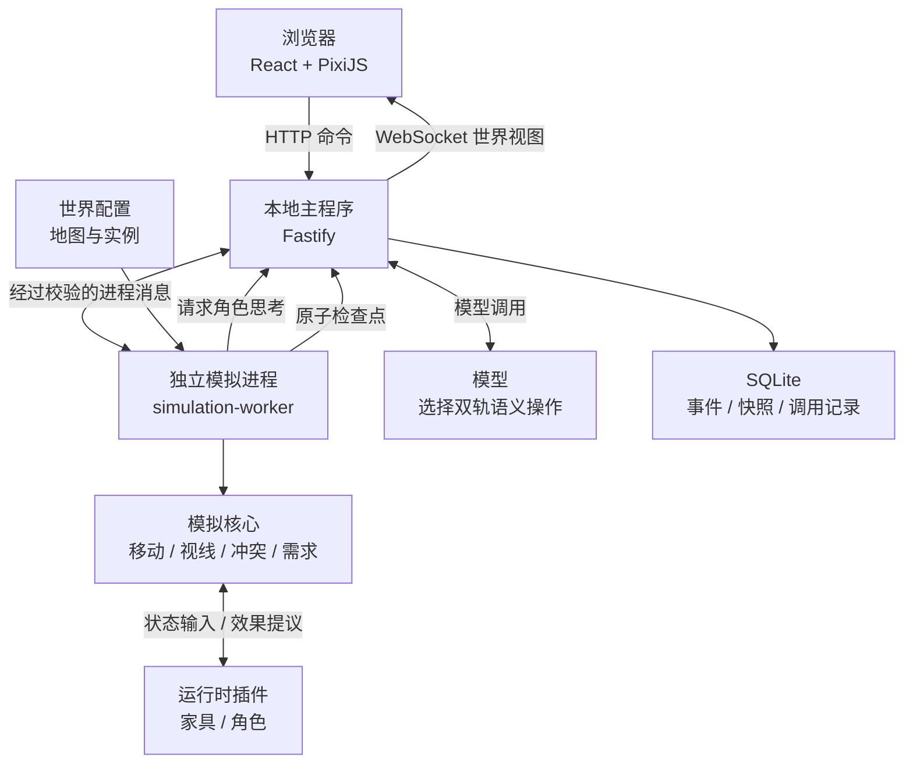

# God Simulation 当前架构

> 状态：第一里程碑已实现的架构
>
> 范围：本地浏览器版本，不包含云端服务和桌面打包
>
> 角色上下文、感知与记忆系统的原始设计基线见 [《角色上下文、感知与记忆系统原始需求》](./character-context-original-requirements.md)，按依赖排序的待建内容见 [《角色上下文、感知与记忆系统实施 TODO》](./character-context-implementation-todo.md)。

## 1. 架构结论

God Simulation 当前采用本地 B/S、多进程架构：

- 浏览器负责显示世界和接收玩家操作。
- 本地主程序负责浏览器连接、模型调用、保存和日志。
- 独立模拟进程持有唯一可写的世界状态，并执行全部游戏规则。
- 家具和角色以运行时插件提供定义与行为。
- 模型只为 `HEAD/BODY` 两条轨道选择程序提供的语义操作，不直接控制世界。
- SQLite 保存可恢复、可审计的历史，但不参与每个 Tick 的运行判决。

最重要的边界是：**运行时世界才是当前事实，数据库是事实的持久化记录。**

## 2. 总体结构



当前里程碑运行一个本地主程序和一个模拟 Worker。模拟 Worker 是游戏的裁判；本地主程序不能绕过 Worker 修改世界，浏览器更不能直接修改世界。

## 3. 技术栈

| 部分 | 当前选择 |
| --- | --- |
| 主要语言 | TypeScript |
| 运行时 | Node.js 24+ |
| Monorepo | pnpm workspace |
| 浏览器界面 | React、PixiJS、Vite |
| 本地主程序 | Fastify、WebSocket |
| 进程通信 | Node 子进程 IPC、Zod 校验 |
| 数据库 | SQLite、Kysely、better-sqlite3 |
| 模型接入 | OpenAI 兼容 Chat Completions 接口 |
| 测试 | Vitest、Playwright |
| 依赖边界 | dependency-cruiser |

## 4. 目录职责

```text
apps/
  web/                 浏览器界面和地图渲染
  local-server/        HTTP、WebSocket、模型、保存、日志、Worker 管理
  simulation-worker/   独立模拟进程和运行时插件加载

packages/
  protocol/            所有跨边界数据协议
  plugin-sdk/          家具和角色插件公共接口
  simulation/          确定性的世界模拟核心
  cognition/           角色主观上下文和提示词组装
  model-gateway/       模型服务适配层
  timeline/            历史存储抽象接口
  sqlite-store/        SQLite 存储实现

plugins/
  spatial-objects/     墙和门
  home-objects/        冰箱和马桶
  starter-agents/      Alice、Bob 及角色素材

content/worlds/        地图、出生点和家具实例配置
tests/                 架构、单元、场景、进程集成和浏览器测试
scripts/               历史审计和测试启动脚本
docs/                  设计、计划和当前架构文档
data/                  本地数据库与开发日志，不属于源码
```

原始素材整理区不参与运行时。游戏实际使用的素材应归入对应插件的 `assets` 目录，并由插件资源清单引用。

## 5. 依赖方向

`packages/protocol` 是最底层协议包。其他模块只能依赖允许的下层模块：

```text
protocol
├── plugin-sdk ── simulation
├── plugin-sdk ── cognition
├── timeline ── sqlite-store
└── model-gateway

web               只依赖 protocol
simulation-worker 组合 simulation、cognition、plugin-sdk、protocol
local-server       组合 model-gateway、timeline、sqlite-store、protocol
plugins            只依赖 plugin-sdk 和 protocol
```

禁止循环依赖、包对 `apps` 的反向依赖、跨包深层导入，以及正式插件彼此硬编码。规则由 [`.dependency-cruiser.cjs`](../../.dependency-cruiser.cjs) 自动检查。

## 6. 世界状态归属

[`WorldState`](../../packages/simulation/src/world/world-state.ts) 是运行时的唯一权威状态，包含：

- 地图与世界 Tick、版本、运行模式和确定性随机数状态。
- 角色位置、朝向、身体需求、`HEAD/BODY` 任务引用、active operation、感知、知识和即时记忆。
- 家具实例位置、朝向、版本和插件定义的私有状态。
- 当前思考周期、模型请求状态和技术错误。
- 插件锁和最后一个真实事件序号。

各部分只拥有以下权限：

| 部分 | 可以做什么 | 不可以做什么 |
| --- | --- | --- |
| 浏览器 | 读取 `WorldView`、发送玩家命令 | 直接修改角色或家具 |
| 本地主程序 | 转发命令、调用模型、保存检查点 | 自行执行游戏规则 |
| 模拟核心 | 校验命令、推进 Tick、修改世界 | 绕过协议调用外部模型 |
| 插件 | 读取规定上下文、返回效果提议 | 保存实例状态或直接写世界 |
| 模型 | 分别为 `HEAD/BODY` 继续或替换程序提供的任务候选 | 生成任意实体、路径或底层动作 |
| 数据库 | 保存事件、快照和审计记录 | 参与实时冲突裁决 |

家具状态由世界持有，家具处理规则由插件持有。例如，世界保存“门是否上锁”，门插件定义“上锁后通行查询和开门交互如何响应”，模拟核心负责校验并提交最终变化。

## 7. 当前的通道设计

项目没有建立一条任何消息都能进入的万能总线，而是将不同职责分成明确通道：

| 通道 | 流向 | 用途 |
| --- | --- | --- |
| 玩家命令 | 浏览器 → 本地主程序 → Worker | 放行、重试、审查设置等明确命令 |
| 家具交互 | 模拟核心 → 插件 → 效果裁决器 → 世界 | 使用家具并改变合法状态 |
| 思考请求 | Worker → 本地主程序 → 模型 → Worker | 为角色的两条任务轨道选择下一步 |
| 保存检查点 | Worker → 本地主程序 → SQLite → Worker 确认 | 原子保存事件与快照 |
| 世界视图 | Worker → 本地主程序 → 浏览器 | 推送只读的当前世界 |

所有跨进程消息都在 [`packages/protocol`](../../packages/protocol/src/index.ts) 中定义，并通过 Zod 在边界处校验。

插件 SDK 已声明六类触发来源：

- `system_query`
- `active_command`
- `position_change`
- `perception_change`
- `state_threshold`
- `scheduled`

当前通用家具交互接口只正式实现 `active_command`。移动、视线和内急阈值已有专用核心系统，但尚未统一成对第三方插件开放的通用触发通道。后续设计触发通道时必须保留这个事实，不能把枚举预留误认为功能已经完成。

## 8. 家具插件

家具通过 [`ObjectDefinition`](../../packages/plugin-sdk/src/object/object-definition.ts) 定义：

- 唯一 ID、版本和状态版本。
- 私有状态的 Zod Schema 和初始值。
- 放置方式、占用格和可交互位置。
- 是否阻挡移动、是否遮挡视线。
- 自动通行交互，例如未锁门的自动开门。
- 占用能力和同时使用人数。
- 一个或多个主动交互。
- 面向特定观察者公开的可见状态。

交互函数接收角色状态、家具版本、距离、世界 Tick 和触发来源，返回 `EffectProposal`。插件不能直接修改世界；核心的效果裁决器验证版本、目标、数值范围和冲突后，才把效果写入世界。

当前正式家具插件包括：

- 墙：阻挡移动和视线。
- 门：保存开关与上锁状态，支持自动通行。
- 冰箱：支持占用和使用冲突。
- 马桶：完成交互后降低角色内急值。

插件在 Worker 启动时从本地构建产物动态加载。清单、版本、状态版本和构建文件共同形成插件锁；恢复快照时插件锁不一致会明确拒绝启动。当前不支持游戏内安装、热替换或恶意插件沙箱。

## 9. 角色插件

角色通过 [`AgentDefinition`](../../packages/plugin-sdk/src/agent/agent-definition.ts) 定义：

- 背景、性格、价值观、语言和思考方式。
- 初始记忆。
- 角色资源和动画集。
- 可选的提示词贡献器。
- 可选的记忆提炼器。

角色插件定义“这个角色是谁”，世界状态保存“这个角色现在怎么样”。模型看到的内容由角色定义、当前身体感觉、真实记忆、当前可见内容、两条轨道的当前任务和程序生成的任务候选共同组成。

长期记忆总结、遗忘、向量检索和 Reflection 尚未实现；目前只有接口位置和第一里程碑所需的即时记忆。

## 10. 每个 Tick 的执行顺序

[`runTickPipeline`](../../packages/simulation/src/engine/tick-pipeline.ts) 的总体顺序是：

```text
推进 active operation 的内部微步骤
→ 推进世界时间和身体需求
→ 推进移动、等待与家具交互
→ 裁决多人同时使用家具的冲突
→ 校验并提交插件效果
→ 为结果和失败产生真实事件
→ 刷新视线、可观察状态和角色记忆
→ 尝试程序可以完成的局部恢复
→ 无法恢复、operation 完成或需求紧急时请求重新思考
```

程序负责一切能够确定计算的内容，包括寻路、打开未锁的门、寻找替代路线、判断可见范围和执行交互。模型不参与这些步骤。

## 11. 感知与冲突

角色知识不能直接读取完整世界。角色只有在相应感知发生后，才会形成主观知识和记忆。

冰箱冲突的正确链路是：

```text
A 先占用冰箱
→ B 仍按原计划前往
→ B 的视线实际看见冰箱被占用
→ 感知记录成为带真实 Event ID 的记忆
→ 程序尝试等待或局部恢复
→ 无法恢复时才请求 B 重新思考
```

锁门导致寻路失败的正确链路是：

```text
门的内部状态变为已锁
→ 角色继续执行原有计划
→ 寻路或通行过程发现门无法通过
→ 程序寻找其他路线
→ 没有可行路线
→ 失败结果返回角色
→ 角色重新思考，世界暂停
```

这保证角色不会拥有全知视角，也不会因为世界内部发生了自己不知道的变化而凭空改变计划。

## 12. 思考与世界暂停

世界有四种运行模式：

| 模式 | 含义 |
| --- | --- |
| `RUNNING` | 正常推进 Tick |
| `THINKING` | 至少一个角色需要模型决策，世界暂停 |
| `READY_FOR_RELEASE` | 必要决策已经齐全，等待放行 |
| `TECHNICALLY_BLOCKED` | 模型、保存、协议或 Worker 出错，停止推进 |

正常思考链路为：

```text
程序确认角色确实需要重新思考
→ 世界进入 THINKING
→ 先原子保存当前检查点
→ 根据角色主观信息组装提示词
→ 模型对 `HEAD/BODY` 分别返回 `continue` 或 `replace(taskOptionId, arguments)`
→ 校验请求身份、世界版本、插件锁、候选所属轨道和参数
→ 所有必要决策准备完成
→ READY_FOR_RELEASE
→ 玩家放行，或审查关闭时自动放行
→ RUNNING
```

世界暂停的原因是角色正在思考，而不是模型响应很慢。无论模型实际等待多久，世界 Tick 都不会偷偷增加。

## 13. 模型边界

模型请求协议位于 [`decision-contract.ts`](../../packages/protocol/src/model/decision-contract.ts)。程序提供 `taskOptions` 与当前 `activeTasks`，模型返回完整 `TaskDecision`：`head` 和 `body` 都必须明确选择 `continue` 或 `replace(taskOptionId, arguments)`，并附带简短理由。同步占用两轨的候选必须在两项中引用相同候选和相同参数。

结果还必须匹配请求 ID、角色 ID、世界 ID、世界版本、思考周期、协议版本和插件锁。过期响应、未提供候选、错误轨道、不同步参数和不符合 Schema 的参数都会在修改世界前被拒绝。所有被请求角色的有效结果到齐后，双轨变更才作为一个批次原子放行。

当前语义操作包括移动、等待、观察和家具交互。远处家具只提供移动候选；移动完成并熔断后，到达交互位置的下一轮才提供家具操作。路径、自动开门、改道等确定性步骤属于 operation 内部微步骤，由程序负责。

## 14. Event、记忆和保存

Event 表示已经真实发生的事实，不表示尚未执行的意图。角色知识和记忆必须引用真实 Event ID，因而能够追溯“角色为什么知道这件事”。

SQLite 当前包含：

- `worlds`：世界身份。
- `plugin_locks`：本次世界使用的插件集合和构建版本。
- `events`：按世界顺序保存的真实事件。
- `snapshots`：完整世界快照。
- `model_calls`：模型调用身份、状态、结果和耗时。
- `technical_failures`：可追踪和可重试的技术错误。

Event 与 Snapshot 组成同一个检查点，并通过同一数据库事务提交：要么一起成功，要么一起回滚。Worker 只有收到本地主程序的保存成功确认后，才认为检查点已经完成。

数据库不会保存模型密钥、授权头或完整提示词。模型记录只保留调试和审计所需的身份、结果、耗时及错误信息。

## 15. 错误与重试

开发阶段采用“明确暴露错误”的策略：

- 模型错误记录请求 ID、角色、类别和错误消息，并允许重试对应请求。
- 保存错误阻止 Worker 继续越过未保存检查点，修复后重试同一检查点。
- 协议或插件不匹配直接拒绝，不静默兼容错误状态。
- Worker 退出或连接中断由本地主程序明确报告。
- 错误同时写入本地日志和技术错误记录，不能被普通游戏事件吞掉。

## 16. 当前已经完成

- Alice 和 Bob 在住宅地图中行动。
- 固定步进、确定性随机数和可恢复快照。
- 移动、寻路、墙体遮挡和门的自动通行。
- 冰箱占用冲突及“看见后才知道”的感知链路。
- 内急增长、阈值感觉和马桶交互。
- 角色重新思考时的世界暂停。
- 玩家决策审查开关和手动放行。
- 模型失败、保存失败及对应重试。
- 家具与角色运行时插件加载及插件锁。
- SQLite 事件、快照、模型调用和错误记录。
- 浏览器地图、角色检查器和事件展示。
- 架构边界、单元、场景、进程集成和浏览器测试。

## 17. 尚未完成或尚未通用化

- 除 `active_command` 外的通用插件触发通道。
- 可配置的统一冲突优先级和跨系统裁决规则。
- 完整的上帝编辑器、强制意图和记忆编辑。
- 长期记忆、Reflection、遗忘和向量检索。
- 社交关系、持续对话和多人会话。
- 饥饿、疲劳、情绪等更多生活需求。
- 地图编辑器和游戏内插件管理器。
- 插件热替换、安全沙箱和状态迁移工具。
- 时间线回滚、分支比较和历史编辑界面。
- 桌面打包、云端版本、多人联机和移动端适配。

## 18. 后续扩展必须遵守的规则

1. 世界状态只能由模拟进程提交修改。
2. 模型只负责不确定的高层决策，确定性计算继续交给程序。
3. 角色只能依据身体感觉、真实记忆和实际感知做决定。
4. 插件只能通过公共协议查询能力和提交效果，核心不能读取家具私有字段。
5. 新触发方式必须定义执行顺序、可见性、冲突规则和失败行为，不能只增加一个事件名称。
6. 新的跨进程消息必须进入 `packages/protocol` 并通过运行时校验。
7. 任何进入模型输入的记忆都必须能够追溯到真实事件。
8. 重要状态变化必须先形成原子检查点，再开始不可控的外部等待。
9. 数据库只保存恢复和审计所需内容，不成为每 Tick 的同步瓶颈。
10. 新模块必须遵守现有依赖方向，不以方便为由跨层调用。

## 19. 关键代码入口

| 主题 | 文件 |
| --- | --- |
| 家具插件接口 | [`object-definition.ts`](../../packages/plugin-sdk/src/object/object-definition.ts) |
| 家具交互接口 | [`object-interaction.ts`](../../packages/plugin-sdk/src/object/object-interaction.ts) |
| 角色插件接口 | [`agent-definition.ts`](../../packages/plugin-sdk/src/agent/agent-definition.ts) |
| 权威世界状态 | [`world-state.ts`](../../packages/simulation/src/world/world-state.ts) |
| 模拟引擎 | [`simulation-engine.ts`](../../packages/simulation/src/engine/simulation-engine.ts) |
| Tick 主流程 | [`tick-pipeline.ts`](../../packages/simulation/src/engine/tick-pipeline.ts) |
| Worker 世界会话 | [`world-session.ts`](../../apps/simulation-worker/src/runtime/world-session.ts) |
| 本地主程序协调器 | [`session-coordinator.ts`](../../apps/local-server/src/sessions/session-coordinator.ts) |
| Host/Worker 协议 | [`host-worker-message.ts`](../../packages/protocol/src/ipc/host-worker-message.ts) |
| 模型决策协议 | [`decision-contract.ts`](../../packages/protocol/src/model/decision-contract.ts) |
| 时间线存储接口 | [`timeline-store.ts`](../../packages/timeline/src/timeline-store.ts) |
| SQLite Schema | [`database-schema.ts`](../../packages/sqlite-store/src/database-schema.ts) |
| 依赖边界 | [`.dependency-cruiser.cjs`](../../.dependency-cruiser.cjs) |
